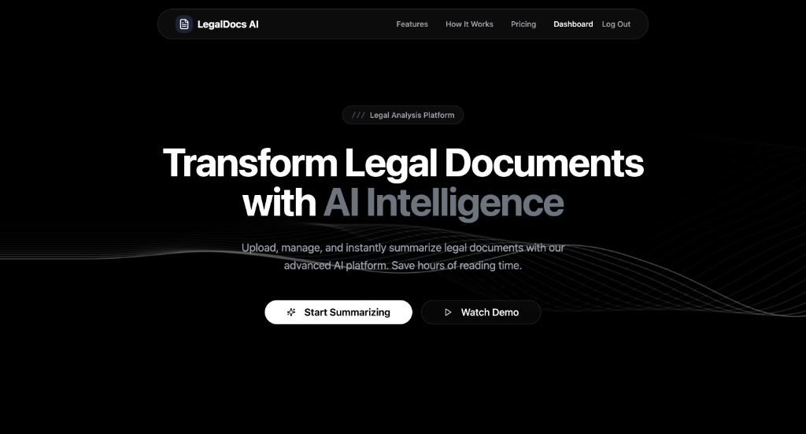

# LegalDocs AI



**LegalDocs AI** is a professional-grade legal intelligence platform that transforms complex court cases, contracts, and statutes into clear, actionable summaries in seconds. Built for speed and reliability, it uses a **RAM-Lite Architecture** to deliver high-performance legal analysis even on resource-constrained hosting environments.

---

## 🚀 Key Features

-   **Instant Legal Analysis**: Process complex PDFs using state-of-the-art models via **OpenRouter**.
-   **🔍 Verifiable Sources**: Every claim in the summary is grounded with inline citations and transparent page references.
-   **💾 Permanent Persistence**: Full accounts and document history managed via **PostgreSQL (Neon)**.
-   **⚡ RAM-Lite Optimization**: Custom "Stuffing" RAG logic designed to run efficiently on 512MB RAM environments like Render.
-   **🛡️ Secure Auth**: JWT-protected dashboard with organizational data isolation.
-   **🎨 Cinematic UI**: Fluid animations and real-time "Engineering Pipeline" visualizations for a premium analytical experience.
-   **📄 Multi-format Exports**: Download analysis reports in PDF, DOC, or TXT formats (Coming Soon).

---

## 🛠️ Tech Stack

| Layer          | Tools / Frameworks                                   |
| :------------- | :--------------------------------------------------- |
| **Frontend**   | React 18, TypeScript, Vite, TailwindCSS, Shadcn/UI   |
| **Backend**    | FastAPI, Python 3.10+, SQLAlchemy, Pydantic          |
| **Database**   | PostgreSQL (Production via Neon), SQLite (Local Dev) |
| **LLMs**       | Arcee-ai Trinity Large (via OpenRouter)              |
| **Deployment**  | Netlify (Frontend), Render (Backend)                 |

---

## 📁 Project Structure

```bash
LegalDocs-AI/
├── backend/
│   ├── main.py              # FastAPI Entry Point
│   ├── summarizer.py        # persistence & History Logic
│   ├── model_pipeline.py    # RAM-Lite AI Core (Stuffing RAG)
│   ├── auth.py              # JWT Authentication
│   ├── models.py            # Database Schema (Postgres/SQLite)
│   └── requirements.txt     # Optimized Dependency List
│
├── client/
│   ├── App.tsx              # Main Router
│   ├── global.css           # Design System & Animations
│   ├── components/          # Reusable UI Blocks (Shadcn)
│   ├── pages/               # Dashboard, SignIn, Features
│   └── lib/                 # Utility functions
│
└── render.yaml              # Infrastructure as Code (Blueprint)
```

---

## 🚦 Getting Started

### 1. Prerequisites
- Python 3.10+
- Node.js 18+
- OpenRouter API Key

### 2. Backend Setup
```bash
cd backend
python -m venv venv
source venv/bin/activate  # Windows: venv\Scripts\activate
pip install -r requirements.txt
# Set DATABASE_URL in .env (defaults to local sqlite)
uvicorn main:app --reload
```

### 3. Frontend Setup
```bash
npm install
npm run dev
```

---

## 🎓 Career & Interview Prep

To facilitate rapid knowledge transfer and interview readiness, the following materials have been generated and committed to the project root:

-   **[interview_questions.md.resolved](file:///Users/prakriti/Downloads/AI%20Legal%20Summarizer%20Assistant/interview_questions.md.resolved)**: A master list of 100 potential interview questions.
-   **[interview_answers_part1.md](file:///Users/prakriti/Downloads/AI%20Legal%20Summarizer%20Assistant/interview_answers_part1.md)**: Detailed technical and soft-skill answers covering architecture, RAG, and performance.

---

## 📜 License & Credits
Developed by **@prakritea**.  
Special thanks to **OpenRouter** and the **FastAPI** community.

LegalDocs AI — *Grounded Legal Intelligence at your fingertips.*